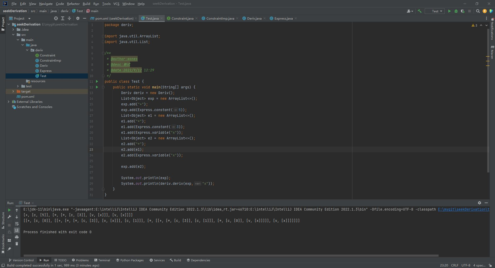

# SymbolicDerivation
Java实现符号求导
# Java符号求导
参考SICP中的符号求导思路，使用Java进行实现
## 1.定义表达式形式
```java
List<Object> exp //表达式
String var //符号
```
表达式有如下几种类型表示形式：
常量 | 变量 | 和表达式| 乘表达式|
---------|----------|---------|----
 ["c",[数值]] | ["v",["符号"]]  | ["+",[被加数],[加数]]|["*",[被乘数],[乘数]] 

例如：
常量5  -> ["c",[5]]
变量x -> ["v",["x"]]
表达式(5 + x) -> ["+",[[["c",[5]]]],[[["v",["x"]]]]]
表达式(3*x) -> ["\*",[[["c",[3]]]],[[["v",["x"]]]]]

## 2.定义求导约束
```java
package deriv;

import java.util.List;

/**
 * @author:wones
 * @desc:求导约束
 * @date:2022/9/12 13:36
 */
public interface Constraint {
    public boolean isNumber(List<Object> exp);
    public boolean isVariable(List<Object> exp);
    public boolean isSameVariable(String v1,String v2);
    public boolean isSum(List<Object> exp);
    public List<Object> addend(List<Object> exp);
    public List<Object> augend(List<Object> exp);
    public List<Object> makeSum(List<Object> a1,List<Object> a2);

    public boolean isProduct(List<Object> exp);
    public List<Object> multiplier(List<Object> exp);
    public List<Object> multiplicand(List<Object> exp);
    public List<Object> makeProduct(List<Object> m1,List<Object> m2);
}

```

## 3.实现求导约束
```java
package deriv;

import java.util.ArrayList;
import java.util.List;

/**
 * @author:wones
 * @desc:实现求导约束
 * @date:2022/9/12 14:05
 */
public class ConstraintImp implements Constraint{
    @Override
    public boolean isNumber(List<Object> exp) {
        String s = (String) exp.get(0);
        if(s.equals("c")){
            return true;
        }
        return false;
    }

    @Override
    public boolean isVariable(List<Object> exp) {
        String s = (String) exp.get(0);
        if(s.equals("v")){
            return true;
        }
        return false;
    }

    @Override
    public boolean isSameVariable(String v1, String v2) {
        if(v1.equals(v2)){
            return true;
        }
        return false;
    }

    @Override
    public boolean isSum(List<Object> exp) {
        String s = (String) exp.get(0);
        if(s.equals("+")){
            return true;
        }
        return false;
    }

    @Override
    public List<Object> addend(List<Object> exp) {

        return (List<Object>) exp.get(1);
    }

    @Override
    public List<Object> augend(List<Object> exp) {
        return (List<Object>) exp.get(2);
    }

    @Override
    public List<Object> makeSum(List<Object> a1, List<Object> a2) {
        List<Object> res = new ArrayList<>();
        String type = new String("+");
        res.add(type);
        res.add(a1);
        res.add(a2);
        return res;
    }

    @Override
    public boolean isProduct(List<Object> exp) {
        String s = (String) exp.get(0);
        if(s.equals("*")){
            return true;
        }
        return false;
    }

    @Override
    public List<Object> multiplier(List<Object> exp) {
        return (List<Object>) exp.get(1);
    }

    @Override
    public List<Object> multiplicand(List<Object> exp) {
        return (List<Object>) exp.get(2);
    }

    @Override
    public List<Object> makeProduct(List<Object> m1, List<Object> m2) {
        List<Object> res = new ArrayList<>();
        String type = new String("*");
        res.add(type);
        res.add(m1);
        res.add(m2);
        return res;
    }
}

```
## 4.实现求导功能
```java
package deriv;

import java.util.ArrayList;
import java.util.List;

/**
 * @author:wones
 * @desc:实现求导
 * @date:2022/9/12 14:14
 */
public class Deriv extends ConstraintImp{

    public List<Object> deriv(List<Object> exp,String var){
        List<Object> res = new ArrayList<>();
        if(isNumber(exp)){
           List<Object> tmp = new ArrayList<>();
           tmp.add("c");
           List<Object> t = new ArrayList<>();
           t.add(0);
           tmp.add(t);
           return tmp;
        } else if (isVariable(exp)) {
            if(isSameVariable( (String)(((List)exp.get(1)).get(0)),var)){
                List<Object> tmp = new ArrayList<>();
                tmp.add("c");
                List<Object> t = new ArrayList<>();
                t.add(1);
                tmp.add(t);
                return tmp;
            }else {
                List<Object> tmp = new ArrayList<>();
                tmp.add("c");
                List<Object> t = new ArrayList<>();
                t.add(0);
                tmp.add(t);
                return tmp;
            }
        } else if (isSum(exp)) {
            res.add(makeSum(deriv(addend(exp),var),deriv(augend(exp),var)));
        } else if (isProduct(exp)) {
           res.add(makeSum(
                   makeProduct(multiplier(exp),deriv(multiplicand(exp),var)),
                   makeProduct(deriv(multiplier(exp),var),multiplicand(exp))));
        }else {
            new Exception("表达式错误");
        }
        return res;
    }
}

```
## 5.生成表达式
为了方便生成表达式，这里简单的实现了生成常量和变量的方法，其他的一些复杂表达式的生成以后再实现：）
```java
package deriv;

import java.util.ArrayList;
import java.util.List;

/**
 * @author:wones
 * @desc:生成表达式
 * @date:2022/9/12 15:06
 */
public class Express {
    public static List<Object> constant(int c){
        List<Object> c1 = new ArrayList<>();
        c1.add("c");
        List<Object> c2 = new ArrayList<>();
        c2.add(c);
        c1.add(c2);
        return c1;
    }
    public static List<Object> variable(String var){
        List<Object> c1 = new ArrayList<>();
        c1.add("v");
        List<Object> c2 = new ArrayList<>();
        c2.add(var);
        c1.add(c2);
        return c1;
    }
}

```
## 6.测试
完成上述任务后，一个简单的求导程序就实现了，下面进行测试

exp表达式 | var符号 | 
---------|----------|
 5 + 3 * x * x | x | 
```java
package deriv;

import java.util.ArrayList;
import java.util.List;

/**
 * @author:wones
 * @desc:测试
 * @date:2022/9/12 12:29
 */
public class Test {
    public static void main(String[] args) {
        Deriv deriv = new Deriv();
        List<Object> exp = new ArrayList<>();
        exp.add("+");
        exp.add(Express.constant(5));
        List<Object> e1 = new ArrayList<>();
        e1.add("*");
        e1.add(Express.constant(3));
        e1.add(Express.variable("x"));
        List<Object> e2 = new ArrayList<>();
        e2.add("*");
        e2.add(e1);
        e2.add(Express.variable("x"));

        exp.add(e2);

        System.out.println(exp);
        System.out.println(deriv.deriv(exp,"x"));
    }
}

```
运行结果如下：


exp表达式表示为：
`[+, [c, [5]], [*, [*, [c, [3]], [v, [x]]], [v, [x]]]]`


产生结果为：
`[[+, [c, [0]], [[+, [*, [*, [c, [3]], [v, [x]]], [c, [1]]], [*, [[+, [*, [c, [3]], [c, [1]]], [*, [c, [0]], [v, [x]]]]], [v, [x]]]]]]]`


产生结果可以化简为：`6*x`

ps：该程序未实现输入表达式的生成和产生结果的化简，有待进一步优化。
